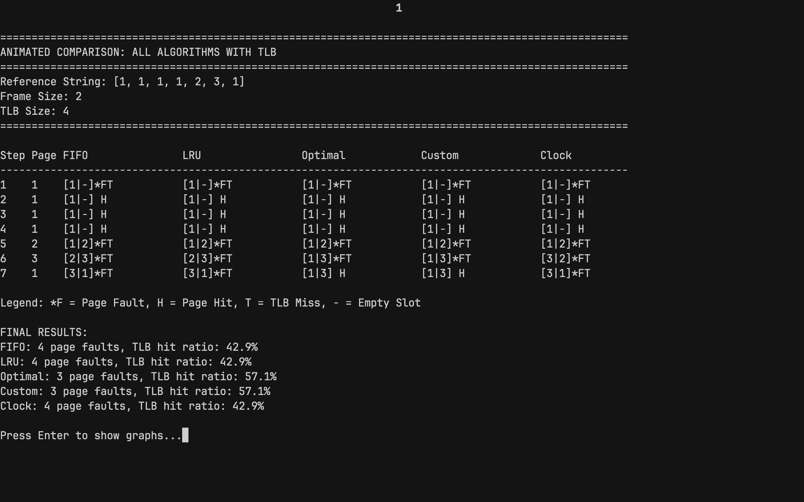

# Virtual Memory Simulator
## Operating Systems Final Project
**Date:** June 23, 2025  
**Course:** Operating Systems  
**Name:** Bowen Chong Xian Zhen

---

# Project Overview

<div class="columns">
<div>

## Part A: Python Simulator
- Address translation (Virtual → Physical)
- Page Table and TLB simulation
- Multiple page replacement algorithms
- Comprehensive logging and metrics

</div>
<div>

## Part B: Linux Demonstration
- Page fault monitoring and analysis
- TLB performance measurement
- Copy-on-Write behavior demonstration
- Memory pressure and thrashing analysis

</div>
</div>

---

# Part A: Address Translation Implementation
```python
def virtual_to_physical(self, virtual_address, page_table, tlb):
    page_number = virtual_address // self.page_size
    offset = virtual_address % self.page_size

    frame_number = tlb.lookup(page_number)
    tlb_miss = frame_number is None

    if frame_number is None:
        if page_number in page_table:
            frame_number = page_table[page_number]
            tlb.update(page_number, frame_number)
            else:
            return None, None, True

        physical_address = frame_number * self.page_size + offset
        return physical_address, frame_number, tlb_miss
```

---

# Part A: Page Table & TLB Implementation

<div class="columns">
<div>

## Page Table
* Simple dictionary mapping: `page_number → frame_number`
* Updated during page replacement
* Invalidated when pages are evicted

</div>
<div>

## TLB Class
* **Size:** 4 entries
* **Replacement:** LRU policy
* **Operations:** lookup, update, invalidate

</div>
</div>

---

# Part A: TLB Key Methods

<div class="columns">
<div>

```python
def invalidate(self, page_number):
    if page_number in self.entries:
        del self.entries[page_number]
        if page_number in self.access_order:
                self.access_order.remove(page_number)
    
def lookup(self, page_number):
    if page_number in self.entries:
        self.hits += 1
        if page_number in self.access_order:
            self.access_order.remove(page_number)
        self.access_order.append(page_number)
        return self.entries[page_number]
    else:
        self.misses += 1
        return None
```

</div>
<div>

```python
def update(self, page_number, frame_number):
    if page_number in self.entries:
        if page_number in self.access_order:
            self.access_order.remove(page_number)
    elif len(self.entries) >= self.size:
        if self.access_order:
            lru_page = self.access_order.pop(0)
            if lru_page in self.entries:
                del self.entries[lru_page]
        
    self.entries[page_number] = frame_number
    self.access_order.append(page_number)
```

</div>
</div>

---

# Part A: Implemented Algorithms

<div class="columns">
<div>

## Standard Algorithms
1. **FIFO** - First In, First Out
2. **LRU** - Least Recently Used
3. **Optimal** - Belady's optimal algorithm

</div>
<div>

## Advanced Algorithms
4. **Custom** - Frequency-based with aging
5. **Clock** - Second chance algorithm with reference bits

</div>
</div>

---

# Part A: Custom Algorithm Design

## Frequency-Based with Aging Algorithm

```python
Score = Age / Frequency
Where:
- Age = Current time - Last access time
- Frequency = Number of times page was accessed
```

<div class="columns">
<div>

## Logic
- Pages with low frequency and high age get replaced first
- Retains frequently accessed pages longer

</div>
<div>

## Benefits
- Considers recency through aging factor
- Balances between frequency and temporal locality

</div>
</div>

---

# Part A: Clock Algorithm Implementation

## Core Concept
Uses circular buffer with reference bits to approximate LRU efficiently.

<div class="columns">
<div>

## Key Data Structures
- **frames[]**: Pages in memory
- **reference_bits[]**: Usage tracking (0/1)  
- **clock_hand**: Next replacement position

</div>
<div>

## Algorithm Logic
```python
while not replaced:
    if reference_bits[clock_hand] == 0:
        replace_page()  # Victim found
    else:
        reference_bits[clock_hand] = 0
        clock_hand = (clock_hand + 1) % frame_size
```

</div>
</div>

---

## Part A: Clock Algorithm Key Features

<div class="columns">
<div>

## Reference Bit Management
- **Set to 1**: On page access
- **Set to 0**: When clock hand passes
- **0 = Replacement candidate**

</div>
<div>

## Benefits
- **O(1) average** replacement time
- **Second chance** for recently used pages
- **Simple implementation** with good LRU approximation

</div>
</div>

---

# Part A: Test Cases

## Test Case 1: Frequency Advantage
- **Reference String:** [1, 1, 1, 1, 2, 3, 1]
- **Frame Size:** 2
- **Expected:** Custom algorithm should retain frequent page 1

## Test Case 2: Sequential Access
- **Reference String:** [1, 2, 3, 4, 5, 6, 7, 8, 9, 10, 11, 12]
- **Frame Size:** 4
- **Expected:** FIFO performs well with sequential access

---

# Part A: Test Cases (Cont.)

## Test Case 3: Temporal Locality
- **Reference String:** [1, 2, 3, 2, 1, 4, 5, 4, 1, 2, 3, 4, 5]
- **Frame Size:** 3
- **Expected:** LRU dominates with recent page reuse

## Test Case 4: Clock Algorithm Demo
- **Reference String:** [7, 0, 1, 2, 0, 3, 0, 4, 2, 3, 0, 3, 2]
- **Frame Size:** 3
- **Expected:** Shows Clock's second-chance behavior

---

# Part A: Test Case 1 Results

<div class="columns">
<div>



</div>
<div>


</div>
</div>

---

# Part A: Test Case 2 Results

<div class="columns">
<div>


</div>
<div>


</div>
</div>

---

# Part A: Test Case 3 Results

<div class="columns">
<div>


</div>
<div>


</div>
</div>

---

# Part A: Test Case 4 Results

<div class="columns">
<div>


</div>
<div>


</div>
</div>

---

# Part B: Page Fault Monitoring

<div class="columns">
<div>

## Tools Used
- `/usr/bin/time -v`
- `mmap()` system call
- `sync && echo 3 > /proc/sys/vm/drop_caches`

</div>
<div>

## Implementation
```c
char *buffer = malloc(100 * 1024 * 1024);
for (int i = 0; i < size; i += 4096) {
    buffer[i] = 1; // Touch each page
}
```

</div>
</div>

---

# Part B: Page Fault Monitoring Output

<div class="centered">


</div>

---

# Part B: TLB Performance Analysis

## Tool Used: `perf stat -e dTLB-load-misses,dTLB-loads`

<div class="columns">
<div>

### Sequential Access
```c
for (int i = 0; i < size; i++) {
    sum += array[i];
}
```

</div>
<div>

### Random Access
```c
for (int i = 0; i < size; i++) {
    sum += array[random_indices[i]];
}
```

</div>
</div>

---

# Part B: TLB Performance Analysis Results

<div class="columns">
<div>


</div>
<div>


</div>
</div>

---

# Part B: Copy-on-Write Demonstration
<div class="columns">
<div>

## Memory Allocation & Setup
```c
size_t size = 10 * 1024 * 1024;
char *memory = malloc(size);
memset(memory, 'A', size);
printf("Parent allocated %zu MB\n", 
       size / (1024 * 1024));
```

</div>
<div>

## Child Process - Triggering COW
```c
if (fork() == 0) {
    printf("Child: Writing to trigger COW...\n");
    for (size_t i = 0; i < size; i += 4096) {
        memory[i] = 'B';  // Write to each page
    }
    printf("Child: COW triggered\n");
    exit(0);
}
```

</div>
</div>

---

# Part B: Copy-on-Write Demonstration Output

<div class="centered">


</div>

---

# Part B: Copy-on-Write Demonstration Output (Cont.)

<div class="columns">
<div>


</div>
<div>


</div>
</div>

---

# Part B: Memory Pressure & Thrashing

<div class="columns">
<div>

## Implementation
```c
volatile int running = 1;
void stop(int sig) {
    (void)sig;
    running = 0;
}

int main() {
    signal(SIGINT, stop);
    printf("Thrashing Demo - Press Ctrl+C to stop\n");

    size_t size = 500 * 1024 * 1024;
    char *memory = malloc(size);

    while (running) {
        for (size_t i = 0; i < size && running; i += 4096) {
            memory[i] = 1;
        }
    }

    free(memory);
    printf("Thrashing demo stopped\n");
    return 0;
}
```

</div>
<div>

## Tools Used

- Custom thrashing program (500MB allocation)
- `vmstat` for monitoring system statistics

</div>
</div>

---

# Part B: Memory Pressure & Thrashing Output

<div class="centered">


</div>

---

# Thank you
